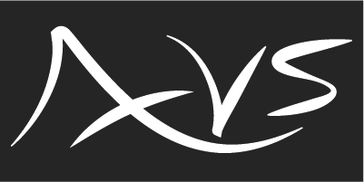
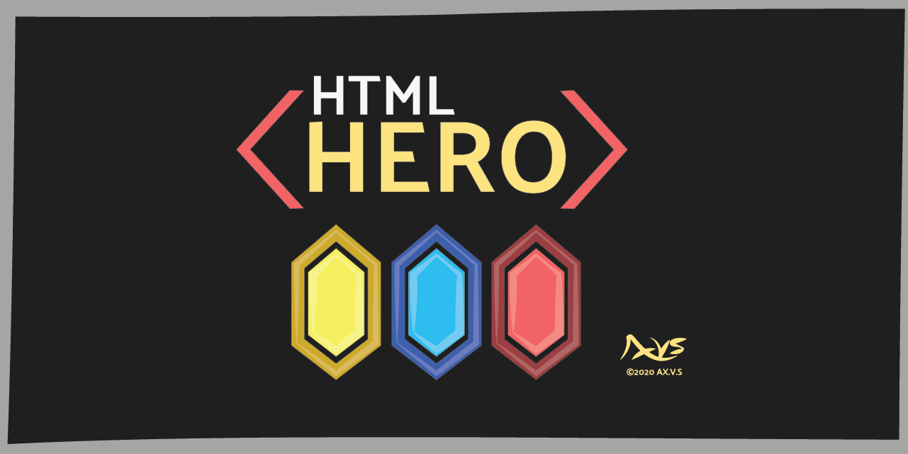

Hello, and thank you for visiting my cloud Gits. I'm a generalist creative, primarily an artist, 3d artist and tech artist, but I also am an experienced programmer. A majority of my programming work is to facilitate art develop or aid in the presentation of my art.

I sign my work using AX.V.S. and it's visual represention something akin to this:

# Packages

---

https://github.com/thoughtcrimes/git_ghost_py

git-ghost is a Python library and CLI tool engineered for managing multiple Git cloud accounts, particularly when one is a personal account vulnerable to doxing and the others are high-stakes or high-visibility projects. Certain projects can attract significant attention, and hostile actors. 

Developers may encounter situations where maintaining a separation between their public and private digital identities is crucial. git-ghost offers solutions for anonymizing Git configuration credentials and commit metadata, which obfuscates the shared ownership of accounts. My hope is that this will limit malicious discoverability of personal accounts and be a layer of protection again doxing, extortion and harm we or our loved ones might face.

---

https://github.com/thoughtcrimes/html_hero_py

html_hero is a simple elegant html building tool designed to add components and advanced processing to web development without invoking bulky opinionated frameworks. It introduces a streamlined component-insertion system, allowing developers to inject reusable elements into HTML pages seamlessly. During the build process, html_hero assembles these components into cohesive pages, resulting in clean, standard HTML. This ensures that developers retain complete command over both the source code and the final rendered output, marrying flexibility with simplicity in web page creation.

---

# Copyright for Artwork and Branding

© 2016-2024 AX.V.S. All rights reserved.

The artwork and branding featured herein are the intellectual property of AX.V.S. and are protected by copyright. Unauthorized reproduction, distribution, or use of these works is strictly prohibited without express permission from the copyright owner.